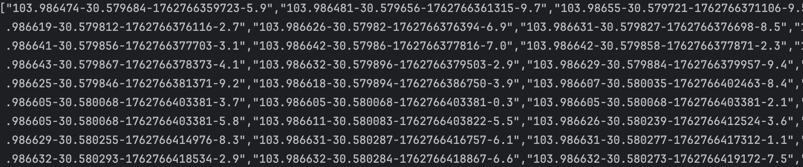

frida rpc调用示例

本次使用目的，將结果用python获取，以方便在python中过略和操作数据（rpc就很好的实现了这点）

先看下hook.js cli调用所用到的代码

```js
function hook(param){
    let App = Java.use("com.example.autorun.helper.App");
    console.log(App.genTack(param));

}


function main() {
    Java.perform(function () {
        hook(5513);
    })
}

setTimeout(main, 1000);
```

转为rpc调用

```js
function hook(param){
    let result = ""
    Java.perform(function () {
        let App = Java.use("com.example.autorun.helper.App");
        result = App.genTack(param).toString();
    });
    return result;
}

// 用rpc.exports导出
rpc.exports = {
    gentask: hook
}
```

python调用

```py
import frida

def on_message(message, data):
    print("[*] Message:", message)
    print("[*] Data:", data)
# 这里需要手动启动应用程序
device = frida.get_usb_device()
session = device.attach("程序名")

with open("hook.js", "r") as f:
    script = session.create_script(f.read())
script.on("message", on_message)
script.load()

# Use RPC to call the function
print(script.exports_sync.gentask(5513))
```



成功获取到返回结果